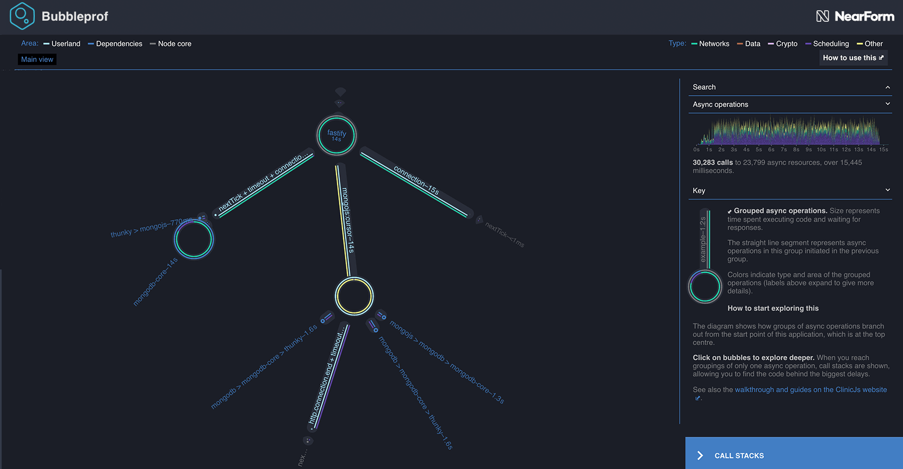

# 分析

Now we're ready to run an analysis. Let's try with the first server in the repo, `1-server-with-no-index.js`.
It contains a small server that queries mongodb for the 5 newest and 5 oldest node modules.

You can run it by simply doing `node 1-server-with-no-index.js` and query it by going to `localhost:3000`
in your browser afterwards. If it returns a JSON response things are working!

Let's try and profile the server with Bubbleprof to see if we can find any bottlenecks. To do that we need
a tool that can send a ton of http requests against the server fast. If you don't have one, `autocannon` is
easy to use. You can install it from npm.

```bash
npm install -g autocannon
```

To run the analysis we want to run the server with Bubbleprof and when the server is ready - i.e. starts listening
on a port - we want to send a ton of requests to it using autocannon. We can do all that in this one single command:

```bash
clinic bubbleprof --on-port 'autocannon -c 5 -a 500 localhost:$PORT' -- node 1-server-with-no-index.js
```

Before running it, let's explain what's happening in there. The part after `--` is simply the command
to start running your server. The `--on-port` flag is a script that is executed as soon as your server
starts listening on a port. The `$PORT` variable in that script is set to the port your server started listening
on. When the `--on-port` scripts ends, the Bubbleprof analysis will run on the data collected from the server
and open the results in a html page.

You may have also noticed `-c 5 -a 500` flags. This tells autocannon to send a fixed amount of requests
(5 connections making a total of 500 requests). By default autocannon tries to apply pressure for full 10 seconds,
then suddenly stops. While very useful for testing load tolerance, this would make it difficult to observe performance
improvements in single components, as most async operations would be active for 95% of the profiling time.

Now try and run it.

It'll take about 15 seconds to run.
Afterwards a html page similar to this should open:



First thought is probably something similar to "That's a lot of bubbles!".

---

## 下一个

[Bubbles](/documentation/bubbleprof/04-bubbles/)
