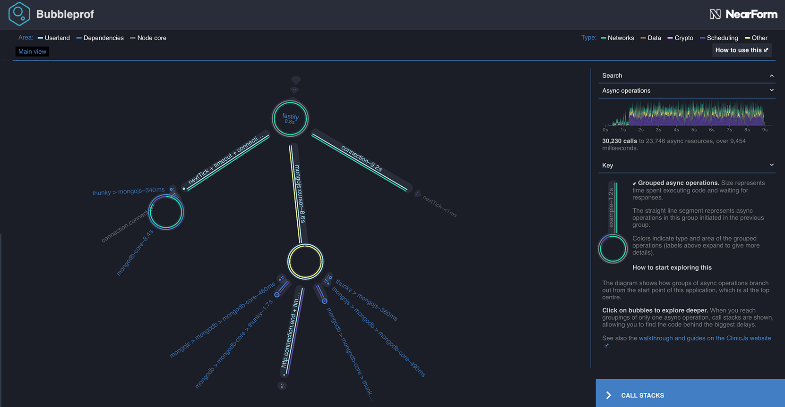
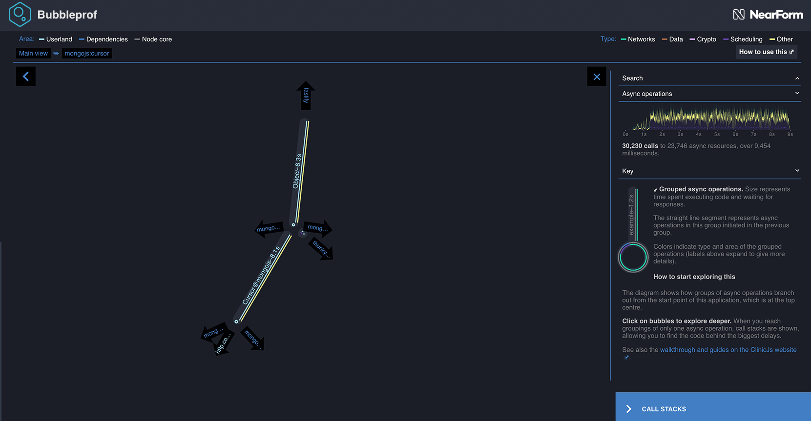

# 改善我们的延迟

In our example, we have already added an ascending index based on the `modified` (datetime)
attribute in our data. This indexed collection is used by the second
example - `2-server-with-index.js`. Let's run our benchmark against this
server and see if we can improve further.

```bash
clinic bubbleprof --on-port 'autocannon -c 5 -a 500 localhost:$PORT' -- node 2-server-with-index.js
```



Much better. We can immediately see that the time in mongo and fastify bubbles has dropped by about one third.
Looking at the timeline we can also notice that the total time to serve those 500 requests went down from 15 seconds to 9 seconds.
Also the timeline itself became denser, meaning we spend less time waiting between serving the requests.
In other words - it took less time to do the same amount of work.

How can we improve this even further? Let's explore the bubbles a bit. The mongodb bubble on the left
is based on the mongodb npm module and there is probably not much we can do to improve this 3rd party
dependency. Same goes for the fastify bubble on the top.

Let's dive in to our query bubble at the bottom:



This bubble clearly shows that our queries are executed in series as one follows the other.
However if we think about this a little bit, there is actually no need for that. Both of the
queries are independent so we can easily execute them in parallel. Doing that would make
this bubble much smaller and hopefully increase performance.

---

## 下一个

[Parallel queries](/documentation/bubbleprof/08-parallel-queries/)
