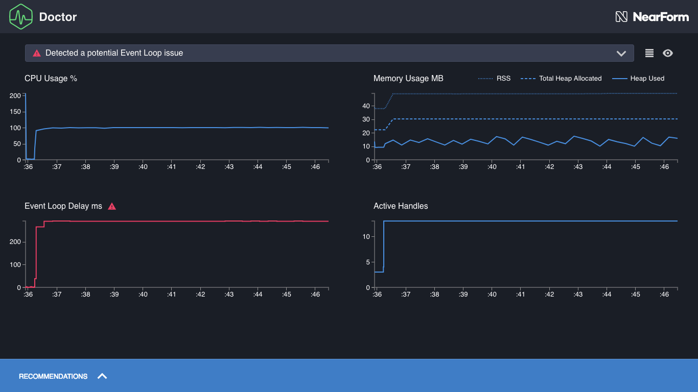

#   首先分析

现在我们准备分析其中一个示例应用程序。
对于第一个例子，我们将使用 `slow-event-loop`。
首先，让我们通过在`examples”目录中运行`node slow-event-loop`来确认它已经准备好并正在工作。
一旦进程似乎正在运行，我们可以在浏览器中访问<http://localhost:3000/>进行检查。

我们应该在浏览器中看到一些基本的输出，比如`{}`。
在命令行中按`Ctrl-C`关闭`slow-event-loop`服务器。

这是一个服务器，所以我们需要加载。
分析一个只处理一个请求的服务器并不能给我们提供很多数据，也不能说明它在处理多个请求时是如何执行的。
我们推荐使用基准测试工具[Autocannon](https://www.npmjs.com/package/autocannon)。

当我们调用 `clinic` 可执行文件时，我们将在示例应用程序目录中执行 `autocannon`，所以让我们使用以下命令全局安装它:

```
npm install -g autocannon
```

为了对服务器进行负载测试，我们希望使用Doctor运行它，并在它开始侦听端口时将`autocannon`指向它。
一旦服务器准备好处理请求并且Doctor准备好收集数据，服务器就会被请求轰炸。

让我们用这个命令来完成所有这些，它会自动分配正确的端口:

```
clinic doctor --on-port 'autocannon localhost:$PORT' -- node slow-event-loop
```

让我们分解这个命令:

- `clinic doctor`部分调用医生命令工具。
- `--on-port`标志将在服务器开始侦听端口时立即执行提供的脚本。
- 该脚本中的`$PORT`变量被设置为服务器开始侦听的第一个端口。
- 双破折号(`--`)之后的所有内容都是启动我们想要分析的服务器的命令，在本例中是`node slow-event-loop`。

这个命令运行三个可执行文件:`clinic doctor`父可执行文件，`autocannon`可执行文件在`——on-port`和`node`可执行文件。

在运行该命令后，`slow-event-loop`服务器将被来自10个并发连接的请求击中10秒(按照`autocannon`的默认值)。
然后将结果编译成一个HTML文件，该文件应该在浏览器中自动打开。

生成的HTML应该类似于以下内容:



---

##### 下一个

[阅读数据图表](/documentation/doctor/04-reading-a-profile/)
