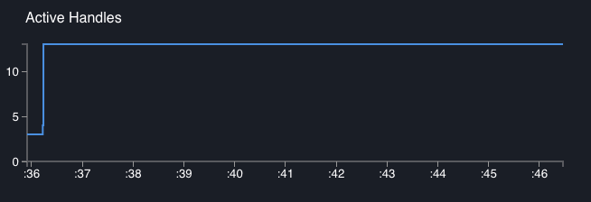

# 阅读数据图表

Clinic.js 的 Doctor 数据图表文件有三个主要部分:

- **警报栏**: 指出了我们的主要问题，如果有的话。 还包含 **View Controls**.
- **图表**: 把医生得出结论的数据画出来
- **推荐面板**: 对问题的详细解释和后续步骤

## 警报栏

点击这个打开它，我们会看到主要问题的一行摘要(如果有的话)。
将鼠标悬停在这个摘要上，它会在医生认为与理解问题最相关的特定图表的标题下划下划线。

医生通常不会识别多个问题，所以这里通常会有一个问题，或者没有发现问题的注释。
这是因为一个性能问题可能会破坏诊断另一个问题所需的数据。
例如，如果 Doctor 确定存在事件循环问题，它可能无法获取足够的读数来判断是否存在 I/O 问题。

第一次使用的用户将主要使用警告栏来查看是否存在检测到的问题，然后直接进入建议面板中的描述以更好地理解它。
更有经验的用户会识别到常见的检测到的问题，然后研究适当的图表，以寻找有关这个特定问题示例如何表现自身的线索。

在上面的例子中，Doctor 告诉我们它检测到一个问题，这个问题是“一个潜在的事件循环问题”，可以在事件循环延迟图中看到:

#### 视图控制器

在警报栏的右边有两个按钮可以改变视图:

-  **Grid
  View / List View.**
  默认情况下，Doctor 在一个网格中显示所有图形，这样它们就可以同时在屏幕上看到。
  此按钮切换到列表视图，其中每个图形占用屏幕的整个宽度。
  这对于想要研究图形细节的高级用户非常有用。
  在列表视图中，单击警告栏中描述的问题，将页面向下滚动到最相关的图形(如果它不在视图中)。

-  **Light
  Theme / Dark Theme.**
  默认情况下，Doctor 使用深色背景和浅色文本的主题。
  这有利于减少眩光，但在某些情况下(或某些个人喜好)，一个主题与
  浅色背景和深色文字效果更好。
  例如，我们可能想要切换到光主题，当截图将打印在纸上，或当投影医生的个人资料在一个光线充足的房间，黑暗的主题很难阅读。

## 图表

这些图绘制了从概要文件的开始时间(x 轴的左端)到结束时间(x 轴的右端)在一段时间内医生分析中使用的各种变量。

所有图形都使用相同的 x 轴。我们将看到，将鼠标悬停在其中一个图形上，会显示所有其他图形在同一时间点的值。

#### CPU Usage %

该图显示了在任意一个时间点，Node.js 进程正在使用的机器可用 CPU 容量的百分比。

_CPU Usage can exceed 100%_ 如果机器有多个内核。在此图中，100%表示单核容量的 100%。

此图中的峰值表示高 CPU 活动。
如果峰值过大并且与事件循环阻塞相关(见下文)，这可能是一个问题，但快速峰值可能表明服务器正在健康地快速处理高负载。
CPU 活动过少可能是 Node.js 进程在等待 I/O 操作完成时卡住的信号，比如缓慢的数据库查询或文件写入。

在此数据图表中，处理器通常相当繁忙，看起来很健康。

在本演练的第 6 部分，[修复 I/O 问题](/documentation/doctor/06-fixing-io-problem/)，
我们将看到一个不健康 CPU 使用图的示例。

#### Memory Usage MB

该图有三条线，显示每个时间点的兆字节内存，所有这些都是相同的比例。

这三行是:

- **RSS (Resident Set Size)**:
  这将始终是最大值，表示作为该进程执行的一部分分配的所有内存。
  这一行和 Total Heap Allocated 一行之间的间隙表示非堆内存，
  例如 JS 代码本身的存储，包含变量指针和像布尔和整数状态这样的原语的“堆栈”，
  以及[Buffer](https://nodejs.org/api/buffer.html)内容的内存池。
- **THA (Total Heap Allocated)**:
  这是为存储具有引用的项(如字符串、对象和函数闭包)而预留的空间量。
  与存储这些项的引用指针的堆栈不同，在需要堆之前，已经为堆分配了预先设定的内存量。
- **HU (Heap Used)**:
  这是此时实际使用的堆内存量。
  它表示在给定时间点已分配但未被垃圾收集的所有字符串、对象、闭包等的总大小。
  **这通常是最有趣的一行**，RSS 和 Total Heap assigned 提供上下文。

不断增加的 Heap Used 行表明可能存在内存泄漏，对某些东西的引用仍然在作用域中，这意味着它永远无法被垃圾收集，因此导致可用内存最终枯竭。
相反的可能是一个更常见的问题:许多急剧下降，与事件循环延迟图中的高读数相关，表明破坏性垃圾收集事件正在中断进程并阻止 Node.js 执行代码。

在这个数据图表中，堆的上升和下降相当缓慢，总是有大量的空闲空间
在常驻集中也有大量的非堆内存。这看起来很健康。

如果我们遇到不健康的内存图，指示问题的特定线将被标记为红色:

#### Event Loop Delay ms

这表示 Node.js 被执行同步 JavaScript 代码阻塞的时间点。

理解这张图的工作原理很重要，因为它也给了我们关于其他图的清晰度的信息:

- y 轴表示在工具提示箭头指示的时刻结束的事件循环延迟的持续时间
- 之后总是有一条水平线表示 x 轴上相同的时间量。
  对于这条线的长度，**Node.js 被阻塞**，因此，我们在任何图形上都没有 _任何_ 数据。
  如果我们沿着包含大量事件循环延迟的图形运行游标，工具提示会跳转—这是因为对于任何图形，
  在跳转之间都无法收集到数据，因为 Node.js 在执行一些缓慢的同步代码时卡住了。

例如，在下面的截图中，我们可以看到:

- 这是(联合)最长的事件循环延迟，因为它是 y 轴上的最高点。
- 通过查看这个工具提示和前一个工具提示之间的水平线，这个延迟占用了概要文件持续时间的一个显著块。

沿着光标移动，我们可以看到四个事件循环延迟占据了大部分运行时间。
我们还可以看到，这导致其他数据变得非常缓慢——大约在第一季度之后，每次读取内存、CPU 等之间都有明显的跳跃，因为 Node.js 忙于执行一些缓慢的同步代码，甚至没有时间进行另一次读取。

这显然是不健康的——医生已经将其标记为健康的，将此图表涂成红色，并在警告框中指出它。

#### Active Handles

该图显示了当前活动的、等待输出的 I/O 句柄的数量。

当 Node.js 异步委托时，例如使用[libuv](https://libuv.org/)将文件写入或数据库查询等任务委托给操作系统，它会存储一个“句柄”。
"active handle"是未报告为完成的委托任务。

因此，活动句柄图可以让我们了解 Node.js 进程在任何时间点等待了多少异步 I/O 活动。
理想情况下，这应该遵循一个有序的模式，随着请求的处理和完成而上升和下降。
当与其他图形结合使用时，它还可以提供线索——例如，服务器上与活动句柄增加相关的 CPU 峰值通常也应该与传入请求相关。

这个图通常为其他图提供上下文。
很难概括地说活动句柄图“应该”是什么样子:在不知道应用程序逻辑的情况下，我们通常不能指着活动句柄图说“看起来不健康”。

在这里，我们有一个活动句柄很少的时间段，其他活动也很少，这可能表示进程准备就绪。
然后有一段稳定的[103]个活动句柄，这可能代表正在处理的传入请求。
它告诉我们，我们可以忽略很少活动句柄的早期阶段，因为它不代表典型的服务器活动。

## 建议面板

点击底部的蓝色条，它将打开一个面板，告诉我们更多关于医生对这个应用程序的结论。

这篇文章分为两部分:推荐摘要和“阅读更多”按钮下方的详细推荐文章。

#### 建议总结

这将对已识别的问题给出一个简单的要点概述，通常还会给出下一步的建议。

这里有一些 UI 控件:

- `x` 关闭面板
- `Browse undetected issues`允许我们阅读医生可以识别但尚未识别此数据图表的问题的描述。
  单击此选项卡将展开一些选项卡，以显示 Doctor 尚未为该数据图表识别的问题的描述。
  我们可能会发现这个很有用，例如:

      - 在学习 Node.js 性能的同时，避免在修复现有问题的同时产生新的问题。
      - 为了理解为什么医生没有发现已知的问题。
        正如在[Alert Bar section](#alert-bar)中所讨论的，医生通常不会同时诊断多个问题。

在这种情况下，它告诉我们“可能有一个或多个长时间运行的同步操作阻塞线程”，并建议使用“临床火焰”来缩小范围。

在阅读了总结后，我们建议点击`Read more`来更深入地了解问题。

#### 详细建议

单击`Read more`将展开建议面板，以显示关于已诊断的性能问题的详细文章。
这些通常有三个部分(点击左边的内容列表可以跳转到一个特定的部分):

- **Understanding the analysis** 深入地描述了问题。
- **Next Steps** 详细介绍了一些建议的步骤，以缩小问题的确切原因，以便我们可以解决它。
  通常，这涉及到使用 Clinic.js 套件中的另一个工具，该工具可以识别有问题的代码的单个行。
- **Reference** 提供了建议进一步阅读的链接，并在撰写本建议时引用或使用了任何来源。

然后我们就可以着手解决这个问题了。

---

##### 下一个

[修复事件循环问题](/documentation/doctor/05-fixing-event-loop-problem)
