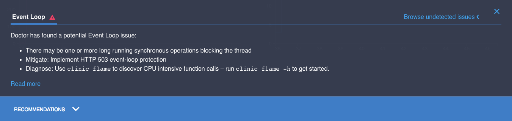

# 修复事件循环问题

在[阅读数据图表](/documentation/doctor/04-reading-a-profile/)中，我们看到了如何理解 doctor 提供给我们的信息，以及为什么它会推荐它所做的事情。现在我们来看看如何解决这些问题。

## 咨询医生

我们已经从`slow-event-loop`中阅读了我们在[首先分析](/documentation/doctor/03-first-analysis/)中创建的数据图表。
在`node-clinic-doctor-examples`中的示例服务器。
我们被告知，我们的问题是缓慢的同步代码[阻塞事件循环](/documentation/doctor/04-reading-a-profile/#event-loop-delay-ms/)，医生建议使用`clinic flame`来识别问题。



## 按照处方

我们可以使用与 Doctor 相同的命令创建一个 Flame 数据图表，但是将`doctor`替换为`flame`:

```sh
clinic flame --on-port 'autocannon localhost:$PORT' -- node slow-event-loop
```

我们的输出看起来像这样:


Flame 默认选择花费最多时间阻塞事件循环的函数调用，并且已经识别出花费最多时间阻塞事件循环的函数是`sleep`，在`slow-event-loop/index.js`的第 12 行。

`node-clinic-doctor-examples` 使用了非常简单的示例服务器:对于这个示例，我们不需要深入研究[Clinic.js Flame 文档指南](/documentation/flame/)中详细介绍的图表或高级特性。

我们可以立即打开 `index.js` ，并在 Flame 找到的行中寻找可修复的瓶颈:

```js
server.get("/", function (req, res, next) {
  sleep(30);
  res.send({});
  next();
});
```

`sleep(30)`调用是选中的一个火焰。
让我们看看 sleep 函数是怎么做的:

```js
function sleep(ms) {
  const future = Date.now() + ms;
  while (Date.now() < future);
}
```

很明显，为什么这会导致事件循环延迟。

事件循环是单线程的:一次只处理一个操作。
对该服务器的每个请求在事件循环中排队一个同步函数，该事件循环包含一个`while`循环，该循环将重复迭代 30 毫秒。
这些都阻塞了事件循环:单个线程忙于迭代 `while` 循环，无法处理任何其他操作。

如果暂停来自异步超时，如来自`setTimeout`，则事件循环不会被阻塞。
包含`setTimeout`的同步代码将继续并完成，然后传递给`setTimeout`的回调函数将在事件循环的单独的未来 tick 中被调用。

然而，这个`sleep`函数是完全同步的。
事件循环被阻塞，直到它完成。

## 治疗疾病

让我们减少循环的持续时间，将传递给`sleep`的参数改为`1`:

```js
server.get('/', function (req, res, next) {
  sleep(1)
```

...save, and recreate the profile:

```sh
clinic doctor --on-port 'autocannon localhost:$PORT' -- node slow-event-loop
```

数据图表现在没有检测到任何问题。
所有的东西都是蓝色的，图表看起来很健康，医生建议小组兴高采烈地告诉我们"Everything looks good!"


这是一个非常简单的示例服务器。
在更复杂的应用程序中，我们通常需要进一步研究 Clinic.js Flame 配置文件，以找出瓶颈的原因。
关于如何做到这一点的详细示例可以在[Clinic.js Flame 文档](/documentation/flame/)中找到。

---

## 下一个

[修复 I/O 问题](/documentation/doctor/06-fixing-io-problem/)
