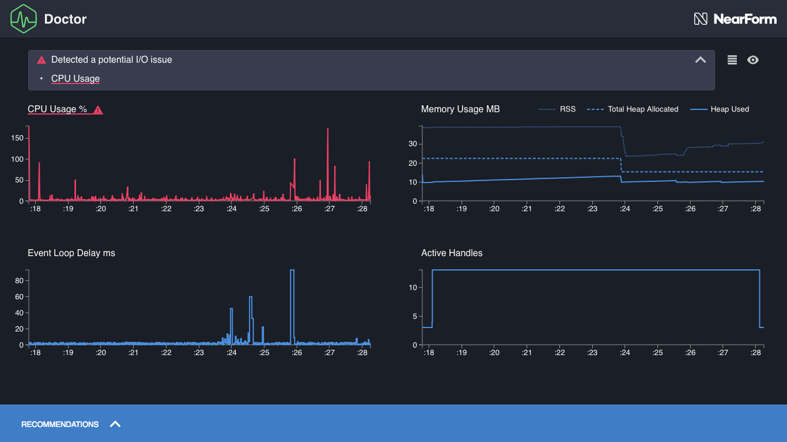
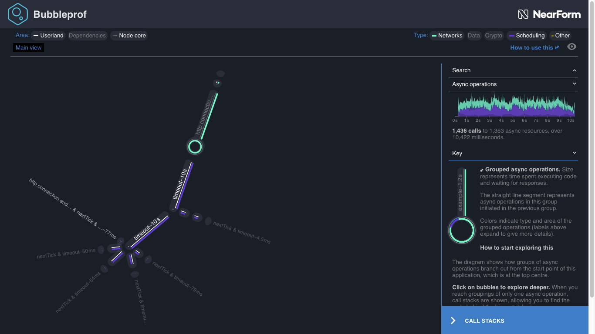
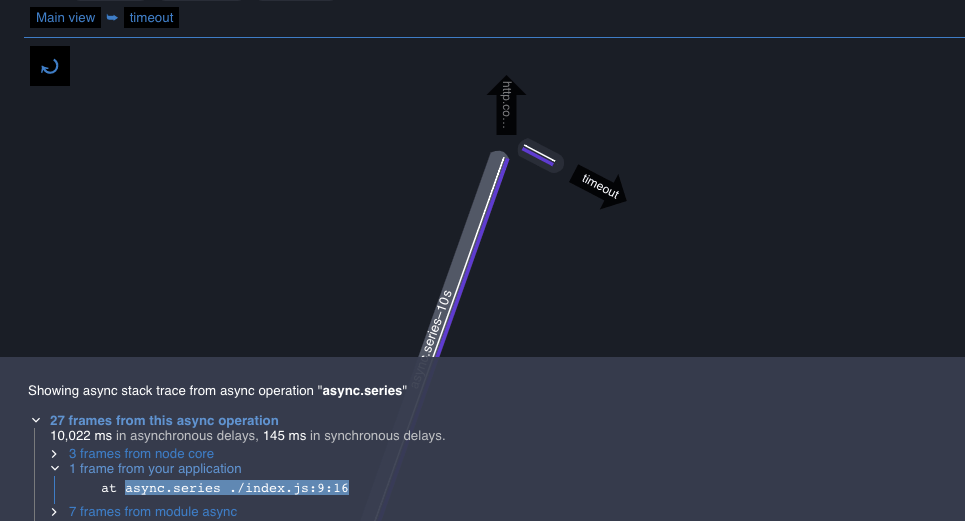
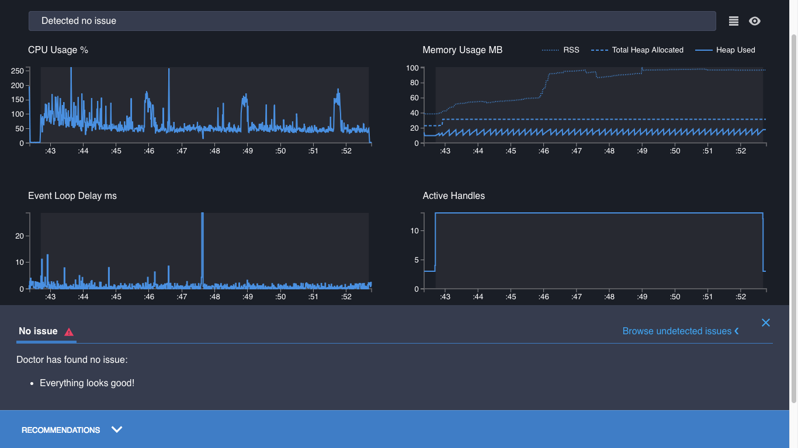

# 修复 I/O 问题

在[阅读个人资料](/documentation/doctor/04-reading-a-profile/)中，我们看到 CPU 使用图可以指出委派给其他进程的 Node.js I/O(输入/输出)操作的问题，例如缓慢的数据库查询或由[libuv](https://libuv.org/)委派的文件写。
让我们通过一个例子来更详细地研究一下。

## 咨询医生

在`node-clinic-doctor-examples`中有一个关于这个问题的示例服务器，称为`slow-io`。
假设我们已经按照[准备](/documentation/doctor/02-getting-ready/)和[分析](/documentation/doctor/03-first-analysis/)中所描述的设置了一切，让我们从该服务器创建一个`Clinic.js`医生数据图表:

```sh
clinic doctor --on-port 'autocannon localhost:$PORT' -- node slow-io
```

输出应该看起来像这样:



CPU 使用率图以红色突出显示。
它显示了几个峰值，但大多数都很低。
在繁忙的服务器上，CPU 活动比我们期望的要少。
建议面板解释说，这可能是由缓慢的异步操作引起的:我们的应用程序正在等待外部 I/O 来解决承诺或触发回调。

这与我们在[修复事件循环问题](/documentation/doctor/05-fixing-event-loop-problem/)中看到的问题非常不同。
建议小组建议我们使用另一个 `Clinic.js` 工具`clinic bubbleprof`。

## 按照处方

我们可以使用与 Doctor 相同的命令创建一个 Bubbleprof 数据图表，但将`doctor`替换为`bubbleprof`:

```sh
clinic bubbleprof --on-port 'autocannon localhost:$PORT' -- node slow-io
```

我们的输出看起来像这样:



`node-clinic-doctor-examples` 使用了非常简单的示例服务器，所以现在我们只需要查看主图，而不需要查看[Clinic.js Bubbleprof 文档指南](/documentation/bubbleprof/)中详细介绍的更高级的特性。

主图显示了一个繁忙的`http.connection`，调用`timeout`，然后并行调用更多的`timeout`。
第一个`timeout`看起来很关键——应用程序的其余部分将从它分支出来。

这可能是我们的瓶颈。

单击它将打开它，显示两个部分。
点击较长的部分指向一些代码:一个函数 `asyn.cseries`，在我们的应用程序中，文件`./index.js`，第 9 行，第 16 列:



如果我们打开`node-clinic-doctor-examples/slow-io/index.js`并找到这一行，我们会看到:

```js
function awaitData(callback) {
  async.series(
    [
      (done1) => setTimeout(done1, Math.random() * 1000),
      (done1) =>
        async.parallel(
          [
            (done2) => setTimeout(done2, Math.random() * 1000),
            (done2) => setTimeout(done2, Math.random() * 1000),
            (done2) => setTimeout(done2, Math.random() * 1000),
            (done2) => setTimeout(done2, Math.random() * 1000),
            (done2) => setTimeout(done2, Math.random() * 1000),
          ],
          done1
        ),
    ],
    callback
  );
}
```

这就是 Node.js 正在等待的-链式超时。

如果延迟是一个外部过程，比如缓慢的数据库查询，那么我们在 Node.js 中看到的线索将是相同的。
我们无法看到外部操作中究竟发生了什么，但是我们可以识别出 Node.js 正在等待的是哪个异步操作。

## 治疗疾病

让我们减少超时的持续时间，将传递给`setTimeout`的第二个参数从`1000`改为`1`。
这模拟了显著加速外部 I/O:

```js
function awaitData(callback) {
  async.series(
    [
      (done1) => setTimeout(done1, 1),
      (done1) =>
        async.parallel(
          [
            (done2) => setTimeout(done2, 1),
            (done2) => setTimeout(done2, 1),
            (done2) => setTimeout(done2, 1),
            (done2) => setTimeout(done2, 1),
            (done2) => setTimeout(done2, 1),
          ],
          done1
        ),
    ],
    callback
  );
}
```

然后保存并重新创建数据图表:

```sh
clinic doctor --on-port 'autocannon localhost:$PORT' -- node slow-io
```

数据图表现在没有检测到任何问题。一切都是蓝色的，图形看起来很健康，CPU 是活跃的，医生的建议面板兴高采烈地告诉我们"Everything looks good!"



这是一个非常简单的示例服务器。
在更复杂的应用程序中，我们通常需要更深入地研究 Clinic.js Bubbleprof 数据图表，以深入了解瓶颈的原因。
如何做到这一点的详细示例可以在[Clinic.js Bubbleprof 文档](/documentation/bubbleprof/)中找到。

---

## 下一个

我们现在熟悉了如何使用 Doctor 来识别问题的类型。
下一步是学习更多关于这些工具的知识，我们可以使用这些工具来磨练特定的代码。

现在，我们准备好进入以下内容的演练文档:

- [Clinic.js Flame](/documentation/flame/), 用于识别慢同步代码
- [Clinic.js Bubbleprof](/documentation/bubbleprof/), 查找异步代码中的问题
