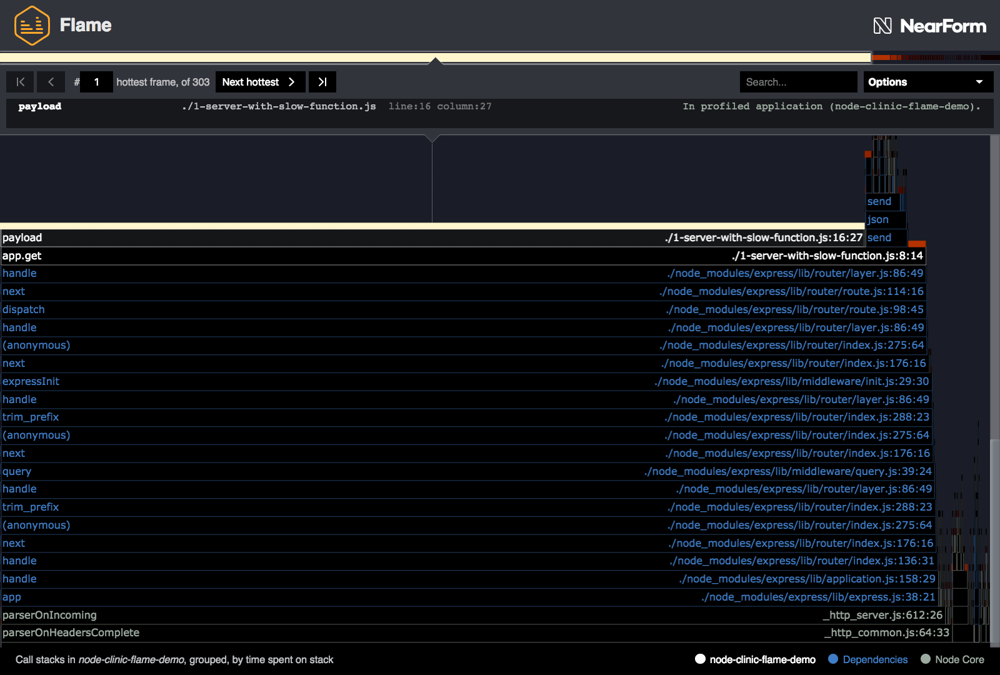
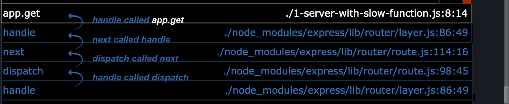
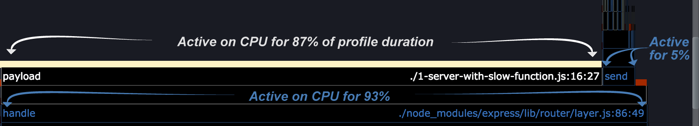
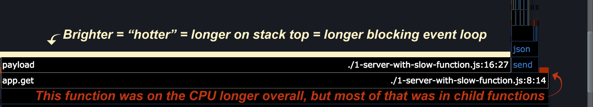

# 火焰图

让我们再看一下在前面[首先分析](/documentation/flame/03-first-analysis/)步骤中生成的火焰图.

暂时忽略周围的控件，让我们专注于理解可视化。

在生成火焰图时，我们要问三个关键问题:

- 在抽样期间，哪些函数相互调用?
- 每个函数在 cpu 上运行的时间是多少?
- 每个函数在栈顶被观察的时间是多少?

这三个问题的答案显而易见。

## 哪些函数相互调用(堆栈)

每个块代表一个函数的调用，由导致该函数的调用堆栈聚合。当一个块位于另一个块的顶部时，它被它下面的块调用，它被它下面的块调用，以此类推。

在 Clinic.js Flame 中，每个块的文本和轮廓颜色可以帮助你导航。
白色代表被分析的应用程序中的代码(即在您直接控制下的代码)。
蓝色代表你在 node_modules 中的依赖，而灰色代表 Node.js 核心本身的代码。

## 一个函数在 cpu 上的总长度(块宽度)

块的宽度表示在概要文件运行的持续时间之外，它在 CPU 上的时间量。
这并不一定意味着函数在执行它自己的代码:在它上面有块的地方，它已经调用了那个函数，正在等待它完成。

Flame 对每个函数调用的函数进行排序，以便最宽的块(在 CPU 上花费时间最长的函数)首先显示在左侧。

## 函数在栈顶(“heat”)出现的频率是多少?

这可以改写为:“一个函数阻塞了 Node.js 事件循环多长时间”。
如果一个函数经常在堆栈的顶部被观察到，这意味着它花费更多的时间来执行自己的代码，而不是调用其他函数或允许函数回调触发。

在 Node.js 中，每次只能执行一个函数(忽略 Worker 线程之类的可能性)。
如果一个函数需要很长时间才能执行，那么就不会发生其他任何事情，包括触发 I/O 回调。
这就是“阻塞事件循环”的本质。

沿着暴露的块顶部的条的亮度表示在堆栈顶部观察函数的时间百分比。
换句话说，一个块越热(或越亮)，它执行自己的代码所花费的实际时间就越多，从而阻止任何其他代码的执行。

当一个函数阻塞事件循环的比例高于其他函数时，我们称之为“热”函数。
寻找这些“热门”函数是开始寻找优化代码的好地方。
Flame 默认选择“最热”的帧，并控制下一个最热帧的循环。

---

## 下一个

[控制器](/documentation/flame/05-controls/)
