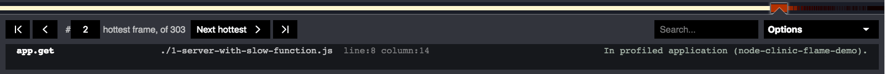
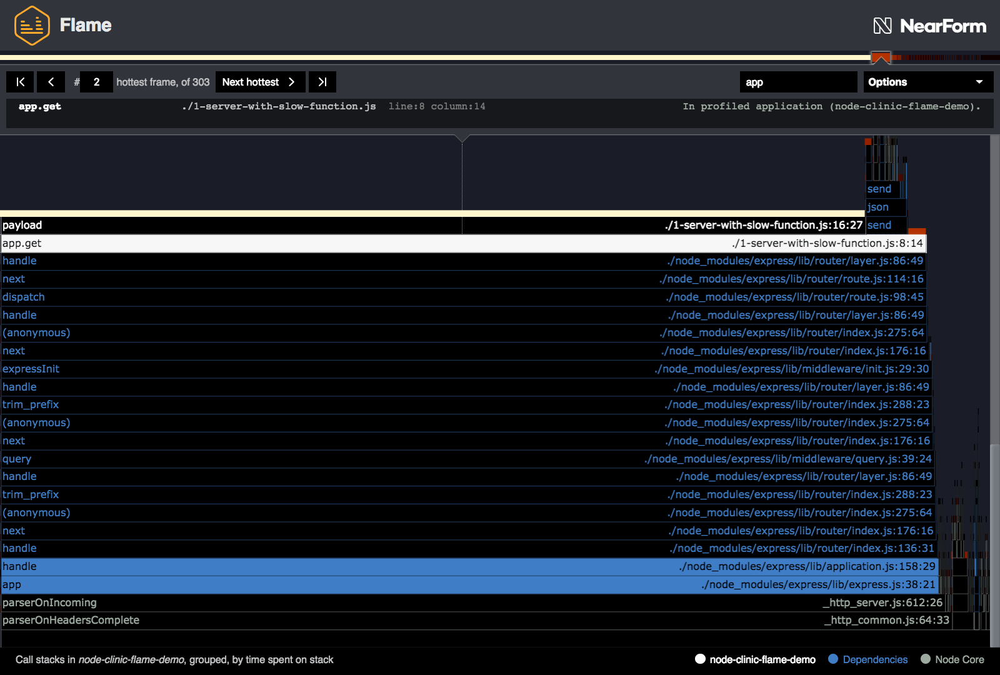

# 控制器

' Clinic.js ' Flame UI 控件有三个主要部分:

- **Flamegraph controls**: 与火焰本身相互作用
- **Info Panel**: 沿着顶部，包含当前突出显示的块的信息
- **Options Menu**: 更高级的控件可从信息面板展开

## 火焰图控件

#### 与火焰块交互

**Hovering** 鼠标停留在一个块上，将在屏幕顶部的信息面板中暂时显示有关该块的信息。

**Clicking** 将选择块，使信息面板恢复到该块，当你不再悬停在任何东西。

如果你发现了一个看起来很有趣的方块，点击它是很有用的，这样你就可以在它周围徘徊，探索它的邻居，而不会失去它。

<video src="../../../assets/videos/flame-docs-A.mp4" playsinline loop autoplay muted></video>

#### 工具提示按钮

在一个块上点击一次，或者在它上面悬停一会儿，一个工具提示出现，有一个或多个按钮:

- **Expand**. 关于扩展特定块的更多信息，请[参见下面]((#expanding)的。
- **Contract**. 如果这是您已经展开的块，它将显示“Contract”而不是“Expand”，这将带您回到主视图。
- **Copy path**. 将包含此块表示的代码的文件的相对文件路径复制到剪贴板。
  这只出现在被分析的应用程序(白色)或它的依赖项(蓝色)中的块上。
- **Open in browser**. 仅适用于 Node.js 核心块(灰色)。
  在一个新的浏览器选项卡中，打开 GitHub 页面，其中显示了该块所表示的 Node.js 函数的源代码。
  探索这些可能是了解更多 Node.js“底层”工作的好方法。

<video src="../../../assets/videos/flame-docs-B.mp4" playsinline loop autoplay muted></video>

#### 扩大

当一个块被双击，或者它的工具提示“扩展”按钮被使用时，它将扩展以填充火焰图的整个宽度。
下面的块也将扩展并填充整个宽度，而点击块上方的块将增加其所在块的比例。
扩展一个块实际上创建了一个新的火焰图，它代表主火焰图的一个特定分区。

已扩展的块在下面用阴影标记。
这个“阴影”下面的每个块可能比已经扩展到整个屏幕的块更宽(在 CPU 上更长)。

要回到未展开的主视图，你可以点击背景，点击屏幕底部的“返回主视图”，
双击展开的框架，或者点击它的“契约”工具提示按钮。

<video src="../../../assets/videos/flame-docs-C.mp4" playsinline loop autoplay muted></video>

## 信息面板

在信息面板中有五个主要功能:

- **Stack bar**: 一个细条，按顺序显示“最热”的块
- **Selection controls**: 轻弹到下一个最热的，以前的，等等
- **Code info**: 当前高亮显示的块背后的功能来自哪里
- **Search box**: 用于通过名称或路径查找函数
- **Options Menu**: 更高级的功能。这个[选项菜单在下面有自己的部分](#options-menu)

#### 堆栈吧

我们之前在[火焰图](/documentation/flame/04-flamegraphs/)页面中解释过，
考虑一个函数在栈顶的时间是多么有用，
这意味着当 CPU 在该函数中执行代码时，Node.js 事件循环被阻塞;
以及这是如何通过一个块的暴露部分的颜色的亮度或“热”来表示的。

这个柱状图显示了每个块的堆栈顶部的热量，按照热量的顺序，即按照块的函数阻塞事件循环的时间的顺序。

您可以沿着此条从左到右运行光标，以查看这些“热”功能在主火焰图上的位置，与上面相同的交互:悬停查看信息，单击选择并显示工具提示，双击展开。

当第一次打开 Clinic.js Flame 配置文件时，默认选择最左边(最热)的块。

<video src="../../../assets/videos/flame-docs-D.mp4" playsinline loop autoplay muted></video>

#### 选择控制

这些按钮允许您轻松地从当前选择的块跳转到堆栈栏显示的热度排名中它的左边或右边的块。

从 Clinic.js Flame 火焰图开始是一个很好的地方，
是循环使用“下一个最热”按钮，对于它选择的每个块，
想想为什么这个函数会花这么多时间活动。
例如，它可能是一个需要优化的慢函数，
或者它可能是一个你知道很快的函数，
但是，当您查看火焰图中它下面的内容时，您可能会发现它被调用了太多次(例如，它可能在嵌套循环中)。

<video src="../../../assets/videos/flame-docs-E.mp4" playsinline loop autoplay muted></video>

#### 代码信息

这将为您提供有关当前突出显示的块背后代码的更完整信息。

- 函数名(或等价的)在左边。匿名函数被标记为' (Anonymous) '。
- 中间的文件路径(或同等内容)，包括行号和列号(如果适用)。
- Context. 它告诉你这个块是什么类别(例如，依赖)，如果使用了某些[高级控件](/documentation/flame/09-advanced-controls/)，它可能包括额外的信息。

#### 搜索框

如果你想找到一些特定的文件或函数，你可以在这里输入函数名、文件路径或同等内容的一部分，任何匹配的都将被高亮显示，使用与文本和轮廓相同的颜色(白色来自被分析应用程序的代码，蓝色来自依赖项，灰色来自 Node.js 本身)。

如果你已经做了很好的优化操作，你就不能再在火焰图上找到它了，这是很有用的!

如果你知道存在的函数在任何地方都找不到，即使使用搜索，它可能已经被 V8 内联了:在关闭["Merge” in the Options Menu](#advanced)后再试着搜索。
有关合并和内联块的更多信息，请参阅[高级控件中的“合并和取消合并”](/documentation/flame/09-advanced-controls/#merging-and-unmerging)一节。

如果它是可能的功能是如此之快，或在 CPU 上的时间如此之少，它从来没有在 CPU 上，而一个样本正在采取，它可能会出现，如果你创建一个新的配置文件[更长时间和/或更多的连接在 Autocannon](https://www.npmjs.com/package/autocannon#usage)。

## 选项菜单

点击信息面板右侧的“选项”将打开一个包含更多高级选项的菜单。

#### 按代码区域划分的可见性

这些切换按钮根据代码在应用程序或 Node.js 框架中的位置显示(打勾)或隐藏(不打勾)块。

- **[Application name]**: 被分析的主包内的代码。默认是可见的。
- **Dependencies**: ' node_modules '目录下依赖项中的代码。默认是可见的。
- **Node JS**: 代码在 Node.js 核心。默认是可见的。
- **V8**:V8 JavaScript 引擎内部的函数。默认隐藏，建议高级用户使用。 [More info](/documentation/flame/09-advanced-controls/#v8)

#### 先进的

- **Init**: 允许初始化函数显示，Flame 默认隐藏。 [More info](/documentation/flame/09-advanced-controls/#init)
- **Merge**: 允许为 V8 优化的函数显示不同的堆栈。 [More info](/documentation/flame/09-advanced-controls#merging-and-unmerging/).

#### 首选项

- **Presentation mode**: 增加文本大小和颜色对比，这可能是有用的，如果 Clinic.js 火焰是在次优条件下呈现(例如在一个明亮的房间里的投影仪上)。

通过将“PRESENTATION_MODE”环境变量设置为“TRUE”，可以将配置文件设置为默认以呈现模式显示。

<video src="../../../assets/videos/flame-docs-F.mp4" playsinline loop autoplay muted></video>

---

## 下一个

[优化热函数](/documentation/flame/06-optimizing-a-hot-function/)
