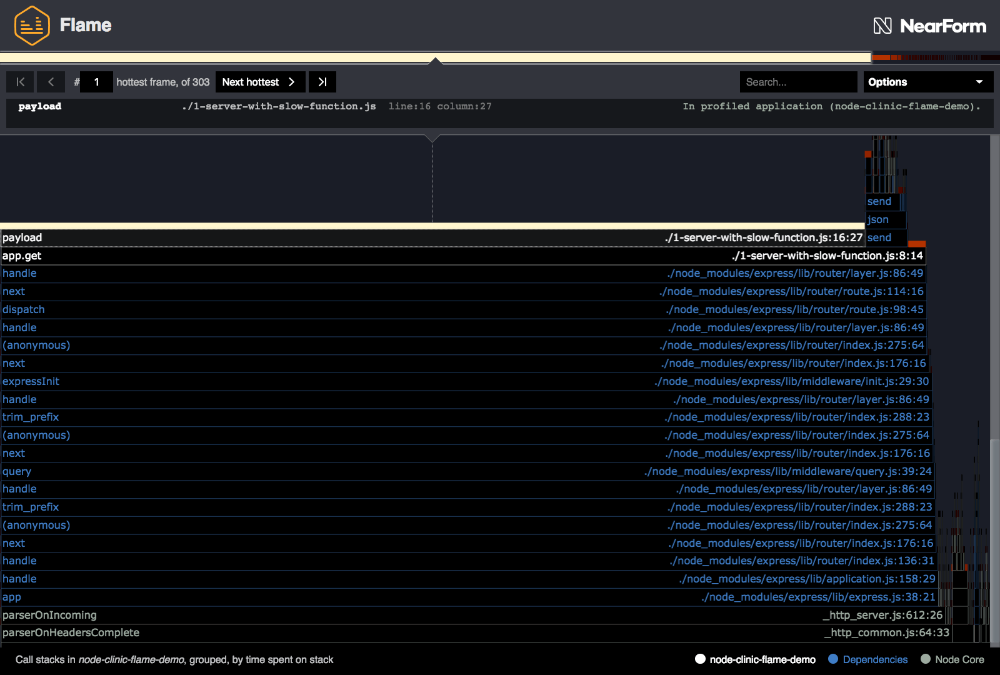

# 优化热函数

“Clinic.js”的 Flame UI 为我们指明了“最热门”的函数。
其中一个非常突出:' 1-server-with-slow-function.js '中的' payload '函数，第 15 行。

我们还可以看到，这个热门的“负载”函数是由第 8 行第 14 列的“app.get”调用的。



让我们看一下从第 8 行开始的函数:

```js
app.get("/", (req, res) => {
  res.send(payload());
});
```

这个函数实际上是一个胖箭头函数，它是匿名的。
在没有名称的情况下，Flame 采样器将此函数命名为“app.get”，因为它被传递给了“app.get”。
列号(14)清楚地表明，所讨论的函数是胖箭头函数。

这是' / '的路由处理程序，它在每次发出请求时被调用。
它调用' payload '函数(我们的瓶颈)，然后将其传递给' res.send '。

让我们看一下第 16 行:

```js
return function payload() {};
```

因为有一个' return '语句，所以必须有一个外部函数。让我们来看看整个东西，包括创建' payload '函数的外部函数:

```js
function initPayload(idSize = 20) {
  return function payload() {
    let chars = "";
    let n = idSize;
    const date = Date.now();
    const radix = 36;
    n *= n * idSize;
    while (n--) {
      const num = date + n;
      chars += num.toString(radix).toUpperCase();
    }
    const id = chars.slice(-idSize);
    return { date, id };
  };
}
```

在 initPayload 范围中有一个参数 idSize 默认值是 20。

' payload '函数返回一个带有' date '字段和' id '字段的对象。
日期是用' date .now() '创建的，因此看起来我们无法在那里进行太多优化。
让我们关注“id”是如何创建的。

变量' n '被设置为' idSize '，但随后将其自身乘以' idSize '，本质上是 n³。
然后，' n '变量在' while '循环的每次迭代中减少 1。
' while '循环的主体是将' date '时间戳和' n '加在一起，然后调用' toString(36) ' (' radix '常量是' 36 ')，这将数字转换为字母数字字符串(base36)。
然后将 base36 字符串大写并添加到' chars '字符串中。
最后，从' chars '字符串中取出长度与' idSize '相对应的 a 片以形成' id '。

这是多么奇怪和过度设计的创建 ID 的方式啊。肯定没有人真的会写那样的代码吧? _(旁白:“是的。”)_

让我们改进算法，但保持 id 的基本特性:

- 必须是字母数字字符串
- 它必须通过' idSize '进行配置
- 它的长度不会少于 6 个字符

' initPayload '函数的一个更优版本看起来是这样的:

```js
function initPayload(idSize = 20) {
  if (idSize < 6) throw Error("idSize must be greater than 5");
  const max = 2147483647;
  var count = 0;
  return function payload() {
    count = (count + 1) % max;
    const date = Date.now();
    const chars = count.toString(36).toUpperCase();
    const id = "0".repeat(idSize - chars.length) + chars;
    return { date, id };
  };
}
```

The `max` number is the largest 32bit integer (2³¹ - 1) we use this
to cycle count back round to 0 when it reaches 2³¹. This isn't strictly
necessary for speed in our case, but Node's JavaScript engine (V8) is
optimized for the numbers in 32bit range (since most numbers in practice
tend to be). Additionally, when converted to base36 is (2³¹ - 1) 6 characters,
which means we don't have use a minimum length offset to enforce `idSize`.

Each time the `payload` function is called, `count` is increase by one.
We turn `count` into a base36 string, and upper case it. Then we pad
the beginning of the string with the necessary amount of zeros (which is valid base36)
to create an `id` with a length corresponding to `idSize`.

#### 测试优化后的函数

The optimal `payload` function is in `2-server-with-optimized-function.js`. Let's
profile this server with Flame to assess the result:

```bash
clinic flame --on-port 'autocannon localhost:$PORT' -- node 2-server-with-optimized-function.js
```

This should generate something like the following:


This immediately looks healthier - it's no longer dominated by just one function,
and as a result we have a range of shades of yellow and orange.

Notice the `payload` function is nowhere to be seen. This is because the function
was inlined into its parent: the anonymous lamda function labelled as `app.get`.
There is more information on inlining and merging on the
[Advanced Controls page](/documentation/flame/09-advanced-controls/#merging-and-unmerging).

Using `autocannon` we can show that our optimization has lead to our server
being over 50 times faster (220 req/s vs 11640 req/s).


---

## 下一个

[Reducing the graph size](/documentation/flame/07-reducing-the-graph-size/)
