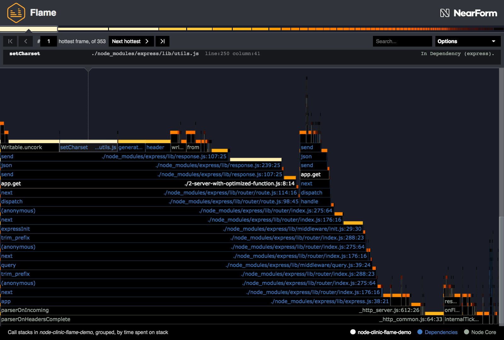
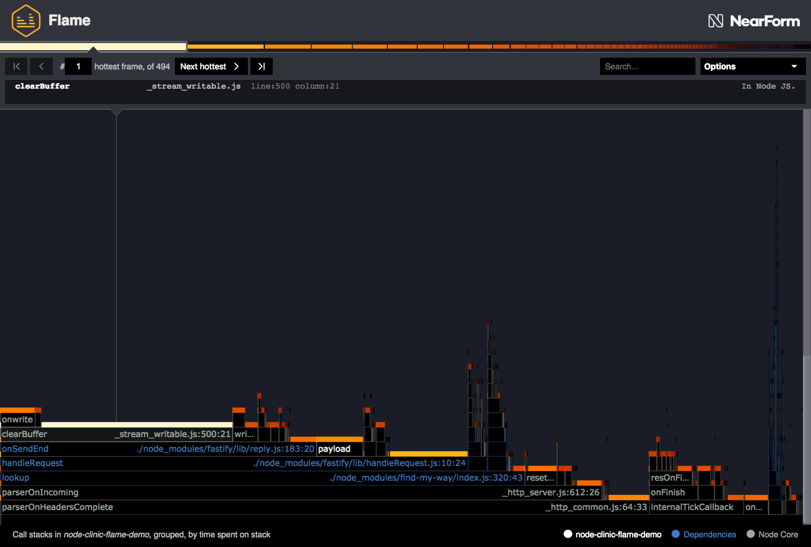

# 减小图的大小

虽然火焰图主要通过可视化栈顶度量来突出瓶颈，但它们也可以用于了解应用程序的复杂性。

如果一个火焰图有很多高上升堆栈，这也可以被认为是一个分布式瓶颈。
如果我们能找到减少图大小的方法，也许是通过删除不必要的层，这也可以提高应用程序的性能。

一个可能容易实现的目标是用更简单或更智能的替代方案替换库，这些替代方案可以在最热门的路径上创建和调用更少的函数。

让我们来看看我们已经为' 2-server-with-optimized-function.js '生成的火焰图:



在' 3-server with-reduced-call-graph.js '中，我们将 web 框架从 Express 改为[fasttify](https://www.fastify.io/)。

让我们为' 3-server-with-reduced-call-graph.js '生成一个火焰图:

```bash
clinic flame --on-port 'autocannon localhost:$PORT' -- node 3-server-with-reduced-call-graph.js
```

让我们来看看最终的火焰图:



这显然更简单，蓝色更少意味着依赖项中的活动更少。
右边有一个蓝色的高柱，但它很细，因此这里很复杂，但速度很快。
然而，在' handlerrequest '下有一些热帧，所以我们可能还可以做更多的事情。

然而，首先，我们必须确认业绩确实有所改善。
减少函数调用和复杂性并不总能带来更快的应用程序。
我们可以使用 autocannon 来测量' 2-server-with-optimized-function.js '和' 3-server-with-reduced-call-graph.js '之间的差异:


这是一个巨大的进步。
通过切换到一个专注于降低函数图复杂性的框架，性能得到了显著提高。
事实上，我们现在可以处理的请求数量几乎是原来的两倍。

---

## 下一个

[Advanced analysis](/documentation/flame/08-advanced-analysis/)
