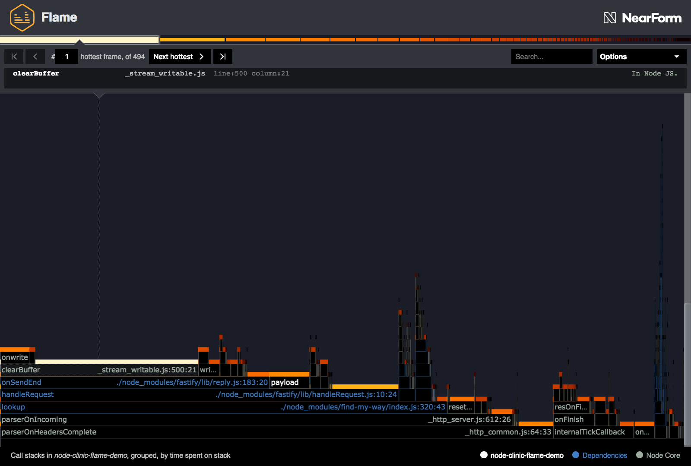
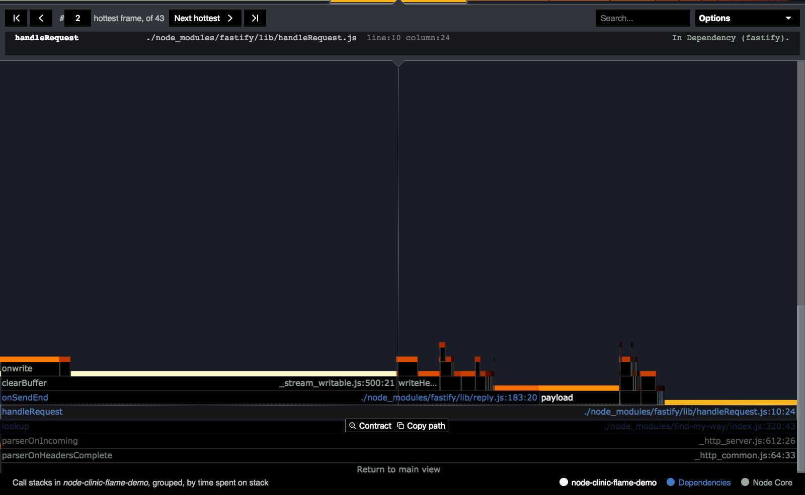
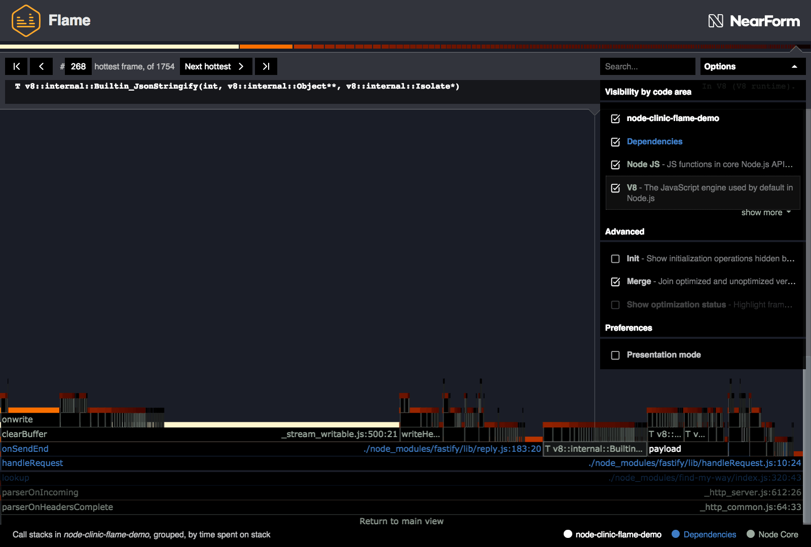
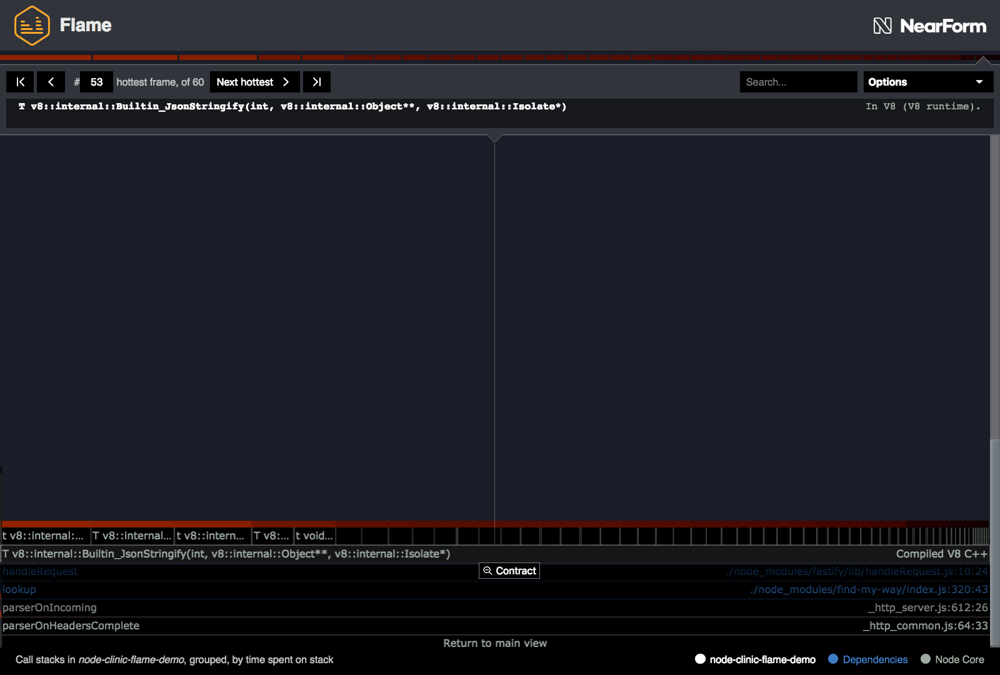
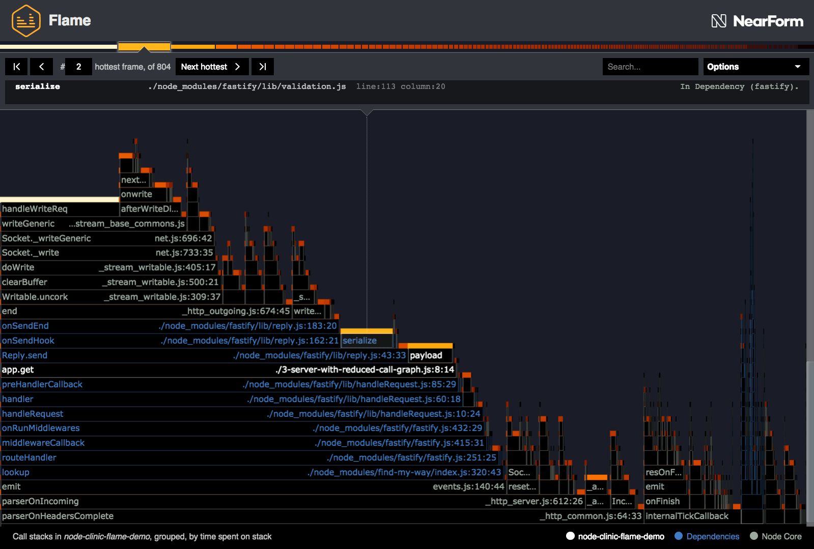
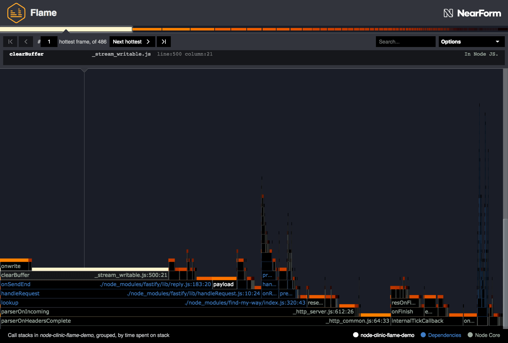
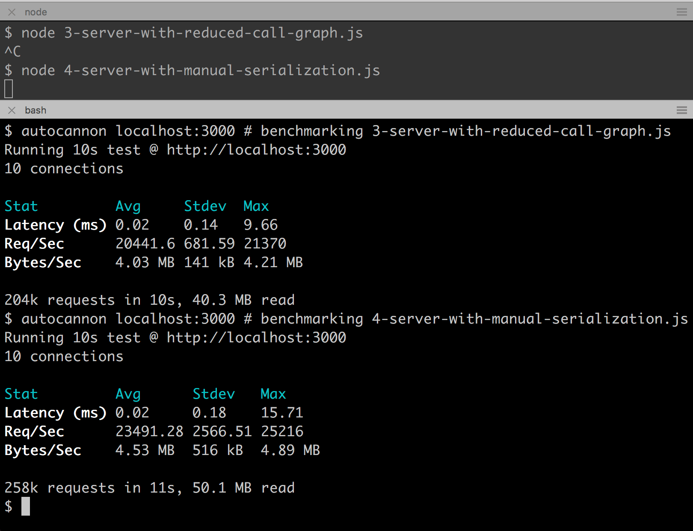

# 先进的分析

在我们最新的火焰图中，我们仍然有一些热块:



最热门的块都没有引用我们的任何代码，但是让我们花一分钟思考一下发生了什么。

最热的是`_stream_writable.js`中的' clearBuffer '。
这是 Node 核心的一部分。
由于这里的目标不是开始优化 Node 核心，让我们看看下一个最热门的块:' handleRequest '。

我们可以将' handleRequest '块展开如下所示:



看看这个子视图中最热门的三个函数:

1. Node.js 的' clearBuffer '是第一个，占了' onSendEnd '内部花费的大部分时间。如前所述，对其进行优化可能很困难。
2. 第二热门的是 fasttify 函数' handleRequest '，它有许多子函数，因此显然非常复杂。
3. 第三个是我们自己的“有效载荷”功能，但我们已经对其进行了优化。

为什么我们要在 handleRequest 里面花很长时间?
如果我们单击 copy path 查看 Fastify 代码，没有什么明显的错误，而且我们知道 Fastify 在性能方面进行了很好的优化。

也许是少了什么?让我们打开 Options 菜单并勾选未勾选的“V8”按钮，显示 V8 JavaScript 引擎内部通常隐藏的操作:



间隙几乎完全消失，出现一个新的块(在上面的截图中选择)，开始' T v8::internal::Builtin_JsonStringify '。
这意味着它指的是 V8 内部的一个 c++函数，名为“Builtin_JsonStringify”。显然，这与' JSON.stringify() '有关。

值得知道的是，我们熟悉的 JavaScript 包装器' JSON.stringify() '和' JSON.parse() '并没有被 V8 直接采样，而是直接跳过底层的 c++实现。

展开它，我们看到 V8 在尝试字符串化 JSON 时需要做很多很多的步骤。



在这种情况下，我们需要关注调用许多微任务的低效父函数，而不是关注一个“热门”函数。
每一个看起来都很快——问题是，它们加起来要花很多时间。

为什么这里会出现 JSON 字符串化?这是因为我们发送一个对象，Express 和 fasttify 都会自动序列化传递给它们的 send 方法的对象。

当我们关闭内联时，这个瓶颈变得更加清晰。

让我们运行以下命令:

```bash
 clinic flame --on-port 'autocannon localhost:$PORT' -- node --no-turbo-inlining 3-server-with-reduced-call-graph.js
```

这将产生类似以下的火焰图:



我们有了一个新的第二热门的函数(仅次于 Node 的核心函数)——“serialize”。
由于被 V8 内联，这在之前是隐藏的。

由于这些函数都没有内联，因此“序列化”函数成为瓶颈的情况变得更加明显。
然而，内联热块更多地出现在堆栈的顶部，因为它们代表了其他几个也被内联到它们中的函数。

' 4-server-with-manual- serialize .js '将' payload '函数中的第 23 行从' return {date, id} '更改为:

```js
return `{"date": ${date}, "id": "${id}"}`;
```

这里应该指出，这种技术在许多情况下可能是不合适的，例如，在转义输入对安全性至关重要的情况下。
手动序列化的另一种选择仍然比使用' JSON.stringify '更快，那就是使用[fast-json-stringify](http://npm.im/fast-json-stringify)进行基于模式的序列化。
Fastify web 框架也默认支持基于模式的序列化，参见[Fastify 的序列化文档](https://github.com/fastify/fastify/blob/master/docs/Validation-and-Serialization.md#serialization)。

让我们运行 Clinic.js Flame 为' 4-server-with-manual-serialization.js '创建一个火焰图:

```bash
clinic flame --on-port 'autocannon localhost:$PORT' -- node 4-server-with-manual-serialization.js
```

这应该给出如下结果:



我们可以看到最热的块是一个 Node 核心函数，' Socket.\_writeGeneric '，它被' clearBuffer '调用。
这和以前一样是 Node 核心瓶颈，只是在这个采样期间 V8 引擎没有内联 Socket。\_writeGeneric '转换为' clearBuffer '。

让我们使用“autocannon”来确定这对服务器性能的影响:



我们又实现了大约 10%的改进。

此时，应用程序的进一步优化变得越来越具有挑战性，因为 Node 核心中的功能已经成为主要瓶颈。
如果我们愿意改变“id”字段的约束条件，那么还可以在这里或那里挤出更多的百分比。

不过，我们在这里的大部分工作已经完成了。

---

## 下一个

**演练已经完成。** 恭喜你!现在你应该可以使用 Clinic.js Flame 来解决常见的性能问题了。

您也可以选择继续阅读有关 Flame 的更多[高级控制](/documentation/flame/09-advanced-controls/).
