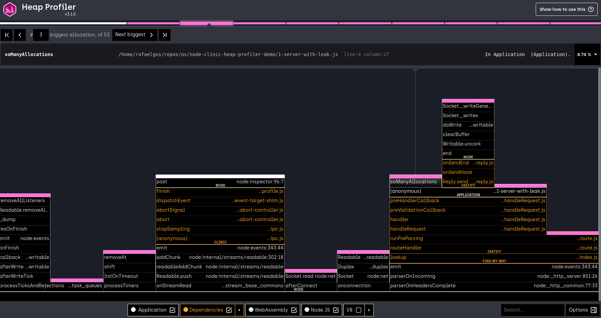

# 首先分析

现在我们已经准备好分析应用程序了。

让我们尝试使用存储库中的第一个服务器，' 1-server-with-many-allocations.js '。

它包含一个 HTTP 服务器，使用 fasttify 构建，带有根路由(' / ')，在收到的每个请求中向全局数组添加一个整数。

服务器可以通过' node 1-server-with-many-allocations.js '启动，然后在浏览器中通过 http://localhost:3000/访问。如果登陆页面显示“Hello World”，那么一切正常!

让我们尝试使用 Flame 对服务器进行分析，看看是否可以找到任何瓶颈。

要做到这一点，我们需要一个工具，可以模拟足够强烈的 HTTP 负载。

我们建议使用“autocannon”，它支持 Windows、Mac 和 Linux，而且使用起来很简单。

让我们从 npm 安装它:

```bash
npm install -g autocannon
```

为了运行分析，我们希望使用 HeapProfiler 运行服务器，当服务器准备好时，我们希望使用“autocannon”向它发送大量请求。

所有这些都可以用一个命令执行，可以原样复制和粘贴:

```bash
clinic heapprofiler --autocannon [ / --method GET -d 120 ] -- node 1-server-with-many-allocations.js
```

Let's break this command down:

- The `clinic heapprofiler` portion invokes the `heapprofiler`
  command tool.
- The `--autocannon` flag will execute the tool as soon as the server starts listening on a port sending tons of requests.
- Everything after the double-dash (`--`) is the command which starts the server that we want to profile, in this case `node 1-server-with-many-allocations.js`.

这个命令运行三个可执行文件:' clinic heapprofiler '父可执行文件，' autocannon '可执行文件和' node '可执行文件。

运行该命令后，将对进程进行 120 秒的负载测试(根据' -d 120 '参数)，然后将结果编译成一个 HTML 文件，该文件应该在浏览器中自动打开。

生成的 HTML 应该类似于以下内容:



这就是所谓的火焰图。

---

## 下一个

[Flamegraphs](/documentation/heapprofiler/04-flamegraphs)
